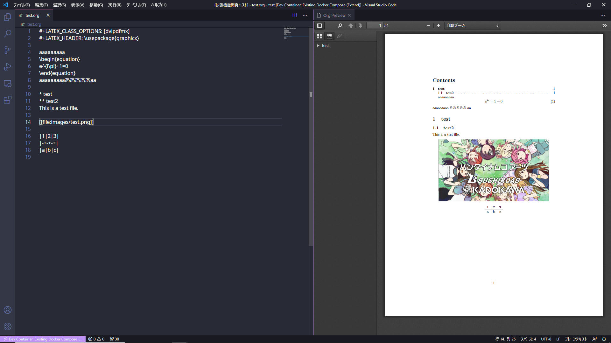

# Org-preview README
Preview extension for org file

## Features
- Exporting active org file to pdf for every saving
- Using docker for exporting on default
- If using docker, Building objects are  exported on CWD/org-mode.tmp
- You can also use a native emacs (need to enable from settings)
- Using PDF.js for rendering

## Requirements
- Docker or Emacs

